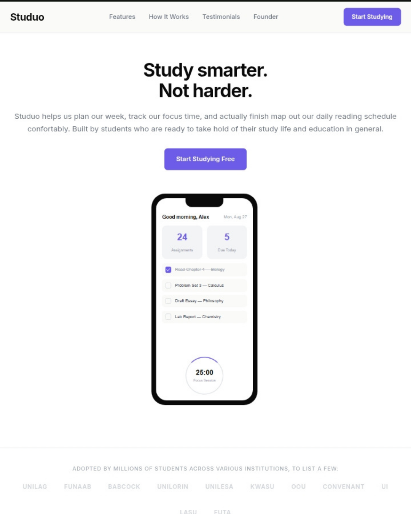
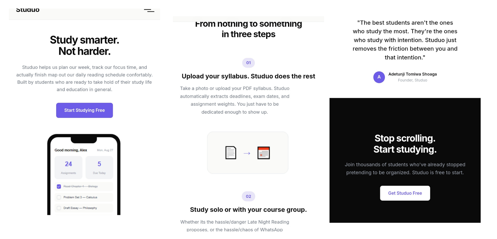

# Studuo Landing Page

A simple landing page for Studuo — a study productivity tool I built for my frontend intern task. Nothing fancy, just clean HTML and CSS that actually works on your phone.

## What It Is

Studuo (Study + Duo, get it?) is a pretend productivity app for students who can't keep their lives together. The landing page shows off the idea — weekly planning, focus timers, progress tracking, group study sessions. Built it all with HTML, CSS, and a bit of JS.

## What's On The Page

- **Top bar** — logo, nav links, and a "Start Studying Free" button. Hamburger menu on mobile.
- **Hero** — big headline, short pitch, and an image of the phone screenshot
- **Social proof** — trusted by UNILAG, OOU, Covenant, UI, LASU, FUTA students
- **Features** — 3 cards: week planner, pomodoro timer, progress stats. Emoji icons because I'm not downloading SVGs on slow internet.
- **How it works** — 3 steps: upload syllabus, group study, watch stats climb. With little CSS illustrations.
- **Templates** — 6 quick-start templates (exam countdown, essay planner, etc.)
- **Testimonials** — 3 fake reviews from students. Initial circles instead of photos.
- **Founder quote** — something deep about studying with intention
- **CTA** — "Stop scrolling. Start studying." Dark section, white button.
- **Footer** — links to nowhere because this isn't a real product yet.

## Built With

- HTML5
- CSS3
- Flexbox & CSS Grid
- Media queries (mobile, tablet, desktop)
- A tiny bit of JavaScript for the mobile menu toggle

## How To Run It

1. Download the files from the repo
2. Open `index.html` in any browser
3. Resize the window to see it adapt

Or just visit the live link below.

## Live Site

🔗 [https://buildlabs-task1-study-tool.vercel.app/](https://buildlabs-task1-study-tool.vercel.app/)

## Screenshots

### Tablet View

### Mobile View

> Desktop view is live at the link above — tested and responsive across all breakpoints.
> 
Built by a student who was tired of pretending to be organized.
